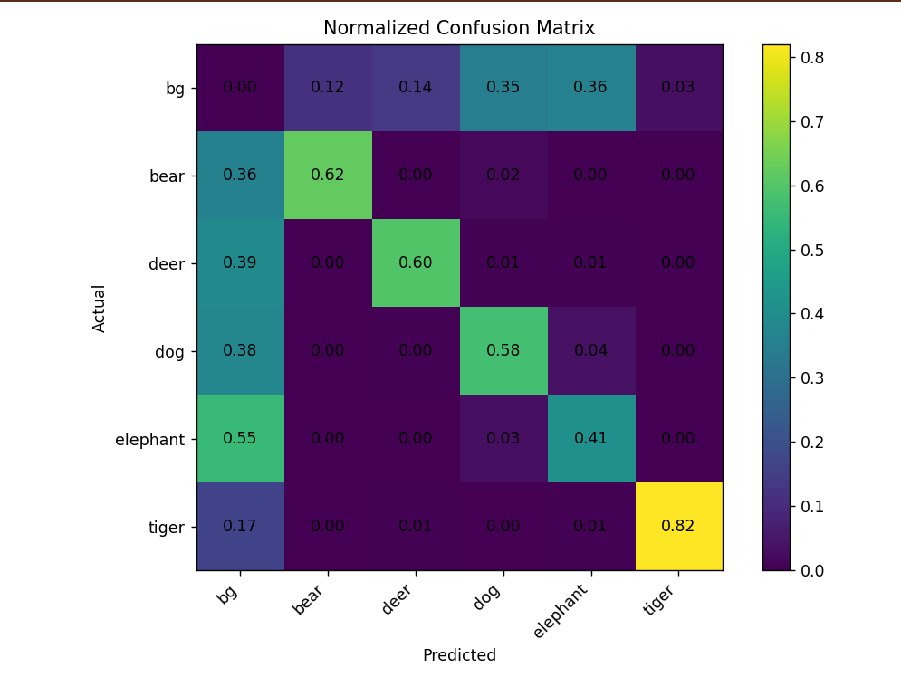

# Wildlife Detection using Faster R-CNN

> ⭐ If you like this project, consider giving it a star!

---

## Project Overview

This project implements a **wildlife object detection system using Faster R-CNN**, focusing on accurate detection of animals in real-world scenarios such as forests, railway tracks, and wildlife sanctuaries.

It is part of a **comparative study with YOLOv8**, where both models are trained on the **same dataset** to analyze the trade-off between **speed (YOLO)** and **accuracy (Faster R-CNN)**.

    YOLOv8 implementation can be found here:
    🔗 https://github.com/Piyush-debug53/real-time-wildlife_detection_YOLOv8s.git
    
---

## Problem Statement

Wildlife movement near human infrastructure (like roads and railway tracks) poses risks to both animals and humans. Traditional monitoring systems lack automation and accuracy.

This project aims to:

* Detect animals in images and videos
* Provide bounding boxes with class labels
* Enable future real-time deployment for safety systems

---

## Dataset

The same dataset was used for both **YOLOv8 and Faster R-CNN** to ensure a **fair comparison**.

* Original format: YOLO (`.txt` labels)
* Converted format: COCO (`.json` annotations)

    **Download full dataset:**
👉 [Google Drive Link](https://drive.google.com/file/d/1dRf1TJCpRDk9r1wVF9HN4N0NuCwbtZol/view?usp=sharing)

> Note: Only a **sample dataset** is included in this repository which already includes annotations.json file for train, val and test.

---

## CLASSES

```markdown
- Bear
- Deer
- Dog 
- Tiger  
- Elephant  

## Annotation Conversion

The dataset was originally in YOLO format.
For Faster R-CNN compatibility, annotations were converted into **COCO format** using:  

```markdown
scripts/coco_conversion.py
```

---

## Tech Stack

* Python
* PyTorch
* Torchvision
* OpenCV
* NumPy

---

## Model Details

* Model: Faster R-CNN
* Backbone: ResNet (Torchvision)
* Type: Two-stage detector

---

## Project Structure

```text
wildlife-detection-faster-rcnn/
│
├── README.md
├── requirements.txt
├── .gitignore
│
├── src/
│   ├── train.py
│   ├── inference.py
│   ├── evaluate.py
│   ├── dataset.py
│   └── webcam.py
│
├── scripts/
│   └── coco_conversion.py
│
├── Sample_Dataset/
│   ├── images/
│   ├── labels/
│   └── annotations.json
│
├── Inputs/
│   └── images/
│
├── outputs/
│   └── images/
│
├── results/
│   ├── confusion_matrix.png
│   ├── results.png
│
└── report/
    └── comparison_report.pdf
```

---

## How to Run

### 1️ Clone the repository

```bash
git clone https://github.com/Piyush-debug53/wildlife-detection-faster-rcnn.git
cd wildlife-detection-faster-rcnn
```

---

### 2️ Install dependencies

```bash
pip install -r requirements.txt
```

---

### 3️ Run inference

```bash
python src/inference.py
```

---

## Requirements

All dependencies are listed in `requirements.txt`.

Install using:

```bash
pip install -r requirements.txt
```

## Demo

#### Sample Results

| Input Image | Detection Output |
|-------------|------------------|
| .jpg) | .jpg) |
| .jpg) | .jpg) |
| .jpg) | .jpg) |

---

## Results

The model was evaluated using standard object detection metrics.

* **mAP@50:** ~ 0.349
* Confusion Matrix included in the `results/` folder

### Visual Results

* Confusion Matrix


---

## Key Insights

* Faster R-CNN achieved moderate accuracy (mAP ~0.35) after 30 epochs of training
* The model performs well on some classes (e.g., tiger, bear) but struggles with others due to false negatives (background predictions)
* Training Faster R-CNN requires careful tuning, longer training, and balanced datasets
* The model is sensitive to dataset distribution and convergence is slower compared to YOLO

---

## Comparison with YOLOv8

| Feature      | YOLOv8                   | Faster R-CNN       |
| ------------ | ------------------------ | ------------------ |
| mAP@50       | **0.55**                 | **0.35**           |
| Speed        | Very Fast                | Slower             |
| Accuracy     | Higher (in my project)   | Moderate           |
| Use Case     | Real-time                | research           |
| Architecture | One-stage                | Two-stage          |

---

## Report

A detailed comparative report between YOLOv8 and Faster R-CNN is included under report folder.

© Piyush Bhatia, 2026  
For academic and portfolio use only.  
Unauthorized reproduction or submission is prohibited.

---

## Future Work

* Improve Faster R-CNN performance using better data balancing
* *ncrease training epochs and apply advanced augmentation
* Deploy YOLO model for real-time wildlife monitoring
* Edge device integration (ESP32-CAM)

---

## Conclusion

Although Faster R-CNN is theoretically known for high accuracy, in this implementation YOLOv8 outperformed Faster R-CNN in both accuracy and speed.

This performance difference is primarily due to faster convergence and a more optimized training pipeline in YOLOv8, which allowed it to generalize better on the given dataset. Faster R-CNN showed higher false negatives, indicating sensitivity to dataset distribution and the need for further tuning.

Therefore, YOLOv8 is more suitable for this project, especially for real-time wildlife detection scenarios.

---

## Author

**Piyush Bhatia**

* GitHub: https://github.com/Piyush-debug53
* LinkedIn: https://www.linkedin.com/in/piyush-bhatia-14274a28a/

---
